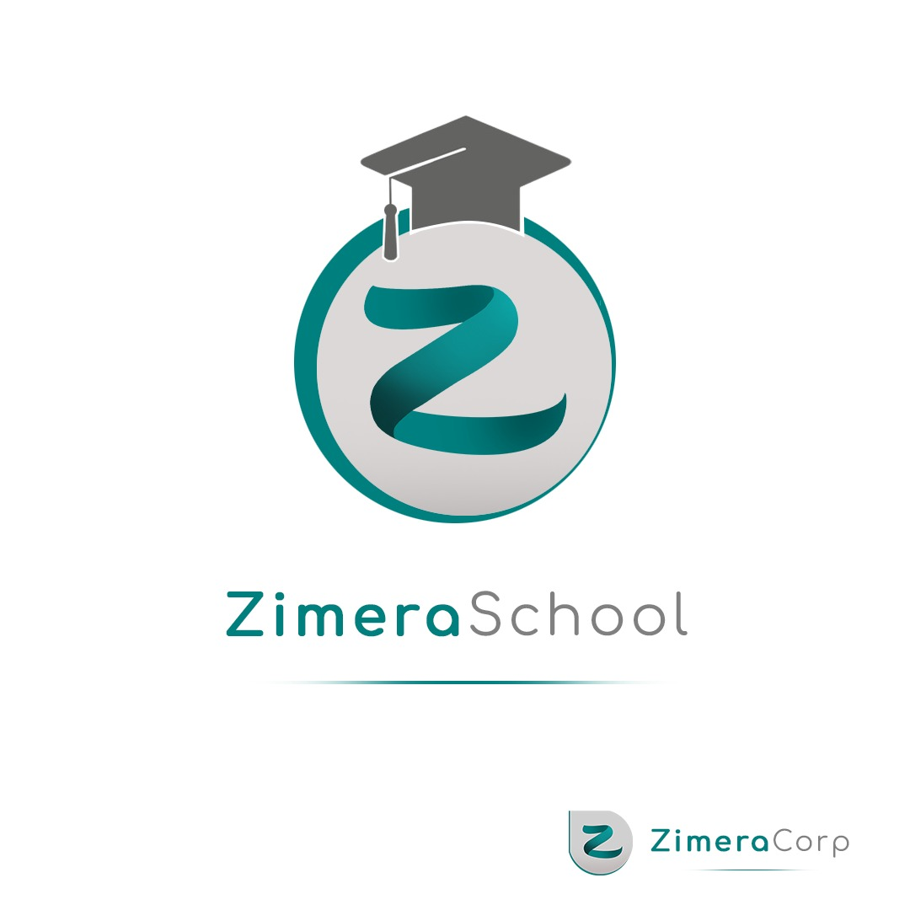

**Zimera School** adalah bagian dari [Zimera Corporation](https://github.com/zimera-corp).

# Materi Pembelajaran

Repo ini berisi berbagai materi pembelajaran di **Zimera School - School of Maker in Software and Data Technologies**. Sekolah di Zimera tidak dimaksudkan untuk mengganti sekolah formal, tidak juga dimaksudkan untuk mempertajam dikotomi antara sekolah formal dengan non-formal. Bersekolah disini hanya membedakan antara siswa dengan *skill*, mentalitas, dan pengetahuan yang memadai dan yang tidak. *So, take this with precautions. Nobody should ever bash anything or anyone*.

## Peta Pembelajaran

Semua pembelajar di sekolah ini akan memulai dari kemampuan dasar terlebih dahulu. Setelah kemampuan dasar selesai, para pembelajar bisa melanjutkan ke jalur yang diminati.

**CATATAN**: Materi dengan status *Work-in-Progress* ditandai dengan tulisan **WiP**

## Kemampuan Dasar

[Materi kemampuan dasar](kemampuan-dasar.md).

## Kemampuan Bahasa Pemrograman

1. [Pemrograman Python](python-programming/).
2. [Pemrograman Go](go-programming/).
3. [Pemrograman JavaScript](js-programming/).
4. [Pemrograman Java](java-programming/).

## Keahlian Spesifik 

1. [Java - Full Stack Developer](java-full-stack/)
2. [Python Web Developer](python-web-developer/) **WiP**
3. [Front End Developer](ront-end/)
4. [Mobile Application Developer](mobile-app-dev/)
5. [JavaScript - Node.js Programming for Backend](js-node-backend/)
6. [Python Programming for Artificial Intelligence - Machine Learning](python-ai-ml/) **WiP**
7. [Natural Language Processing using Python and spaCy](python-nlp/)
8. [Building Data Warehouse using Apache Hive](data-warehouse-hive/)

## Materi Video

Beberapa materi berupa video akan diletakkan pada [Video Pembelajaran](videos/).

## Lisensi

Semua materi pembelajaran di Zimera ini mempunyai lisensi **Creative Commons Attribution-ShareAlike 4.0 International**.

* [Lisensi dalam Bahasa Indonesia](https://creativecommons.org/licenses/by-sa/4.0/deed.id).
* [Lisensi dalam Bahasa Inggris](https://creativecommons.org/licenses/by-sa/4.0/deed.en).

Secara umum, penggunaan lisensi ini mempunyai implikasi bahwa pengguna materi: 

1.  Harus memberikan atribusi ke penulis dan sponsor untuk penulisan materi ini.
2.  Boleh menggunakan produk yang ada disini untuk keperluan apapun jika point 1 di atas terpenuhi.
3.  Boleh membuat produk derivatif dari produk yang ada disini sepanjang perubahan-perubahan yang dilakukan diberitahukan ke kami dan di-share dengan menggunakan lisensi yang sama.

Materi yang terdapat pada sekolah ini awalnya berada pada Praxis Academy dan dikembangkan oleh Dr. Bambang Purnomosidi D. P. Sejak awal 2021, materi dari Praxis Academy yang dikembangkan oleh Dr. Bambang Purnomosidi D. P. telah diambil dan diperbaiki lagi dan disesuaikan dengan domain dari Zimera School yaitu tentang teknologi software dan data. Pengembangan dilakukan oleh Dr. Bambang Purnomosidi D. P. 

### Atribusi

**Dr. Bambang Purnomosidi D. P.**  

**_Zimera Corporation_**  

PT. Zenit Merdeka Raya

Dusun Medelan - RT 01, Umbulmartani, Ngemplak, Sleman, DIY

https://www.google.com/maps/place/Zimera+Systems/@-7.6975303,110.43921,17z/data=!3m1!4b1!4m5!3m4!1s0x2e7a5d7cc40e8871:0x2d44da15f0b3781e!8m2!3d-7.6975303!4d110.4413987

E-mail: zimera.systems@gmail.com

## Kontributor

Made with [contrib.rocks](https://contrib.rocks).
