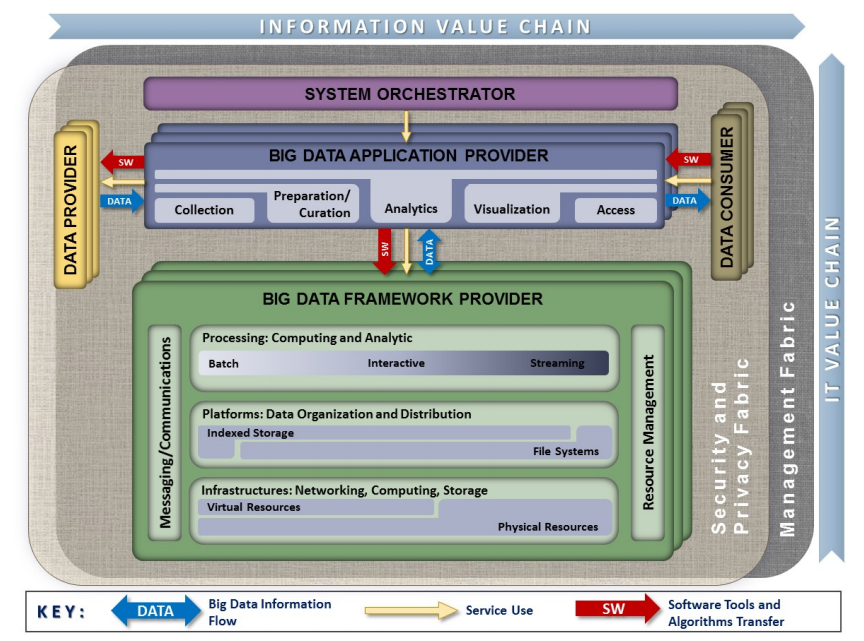

# Memahami Big Data

Sesi ini digunakan untuk memahami Big Data secara umum. 

## Pengertian Big Data

Big Data merupakan kumpulan dari data sets yang sangat besar, masif, dan kompleks yang memungkinkan untuk dianalisis secara komputasional untuk menghasilkan berbagai pola, *insights*, trend maupun keterkaitan antara satu dengan lainnya terutama terkait dengan perilaku dan interaksi manusia. Data yang terdapat dalam Big Data biasanya sangat besar dan / atau bergerak dengan sangat cepat sehingga sulit untuk diproses oleh DBMS serta teknik dalam software tradisional.

## Contoh Big Data

1.  Restauran-restauran waralaba
2.  Transaksi perbankan
3.  Media dan hiburan
4.  Travel dan industri pariwisata
5.  Data terkait perawatan kesehatan

## Karakteristik Big Data

Ada beberapa karakteristik Big Data, semuanya dimulai dengan huruf V. Awalnya hanya ada 3 sehingga
disebut sebagai 3V. Beberapa buku serta referensi mungkin mempunya jumlah V yang berbeda.

### Volume

Jumlah dari data yang diproses dan disimpan sangat besar dan volumenya masif.

### Variety

Data yang diproses mempunyai tipe serta sumber yang sangat bervariasi, tidak hanya teks saja tapi
juga meliputi data multimedia maupun data lain (misalnya file spreadsheet, file PDF, dan lain-lain)

### Velocity

Kecepatan data diproses dan dihasilkan pada Big Data berbeda dengan data tradisional. Velocity pada
Big Data sering kali tersedia secara *real time*.

### Veracity

Kualitas dan nilai data bisa bagus atau bervariasi.

## Arsitektur Big Data

Arsitektur berisi berbagai komponen serta keterkaitan antar komponen yang membentuk suatu sistem. NIST mengeluarkan [arsitektur referensi Big Data](https://nvlpubs.nist.gov/nistpubs/SpecialPublications/NIST.SP.1500-6r2.pdf) yang bisa digunakan sebagai acuan untuk memahami dan membangun sistem Big Data. 

## Teknologi Big Data

1.  Scalable storage systems
2.  Distributed computing platform
3.  Development tools and framework
4.  Packaged analytical tools

## Pemakaian Big Data

Big Data dipakai pada berbagai instansi, organisasi, maupun berbagai keperluan:

1.  Pemerintah
2.  Pengembangan dan Pembangunan Berbagai Bidang
3.  Manufaktur
4.  Kesehatan
5.  Pendidikan
6.  Media
7.  Asuransi
8.  IoT

## Bentuk Data di Big Data

1.  Terstruktur
2.  Semi terstruktur
3.  Tidak terstruktur

## *Use Cases* untuk Big Data

1.  Pengembangan produk: membuat model prediksi untuk produk baru => Netflix, Procter and Gamble
2.  Prediksi pemeliharaan: data terstruktur (identitas dan spesifikasi mesin) dan semi/tidak terstruktur (sensor, temperatur mesin, log, errors, dan lain-lain) digabungkan dan dianalisis untuk menghasilkan kemungkinan masalah potensial sebelum waktunya.
3.  *Customer experience*: data dari mana saja digunakan untuk menangani hubungan dengan customer
4.  *Fraud and Compliance*: identifikasi data untuk mengindikasikan fraud.
5.  *Machine Learning*: Big Data memungkinkan untuk melatih mesin dengan lebih baik.
6.  Efisiensi operasional: data akan menghasilkan insights terhadap situasi operasional.
7.  Memicu inovasi: Big Data digunakan untuk menghasilkan inovasi dengan mempelajari interdependensi antar manusia dan komponen-komponen lainnya dan menghasilkan suatu cara baru.

