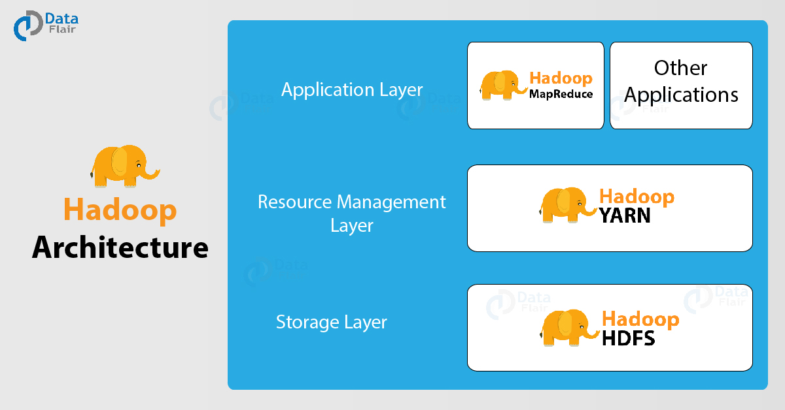

# Mengenal Apache Hadoop

## Apakah Apache Hadoop Itu?

Apache Haddop (sering disebut juga dengan hanya **Hadoop**) adalah software yang dikembangkan dibawah Apache Software Foundation. Hadoop merupakan suatu framework yang memungkinkan pemrosesan data sets yang sangat besar dengan menggunakan *cluster* komputer dalam sistem yang terdistribusi dengan menggunakan model pemrograman yang tidak terlalu rumit. 

Hadoop memungkinkan untuk memanfaatkan satu maupun banyak sekali server (mesin - bisa sampai ribuan) dan masing-masing saling terkoordinasi bekerja bersama untuk memproses *data sets* yang sangat besar. Hadoop memungkinkan untuk mendeteksi dan menangani kesalahan di level aplikasi.

## Arsitektur dan Komponen Hadoop

.

**Catatan:** gambar adalah hak cipta dari DataFlair, diperoleh dari [web DataFlair](https://data-flair.training/blogs/hadoop-architecture/).

## Modul Hadoop

Hadoop terdiri atas:

1.  Hadoop common: utilitas umum
2.  HDFS: filesystem terdistribusi
3.  Hadoop YARN: *job scheduling* dan pengelolaan *resource* untuk *cluster*
4.  Hadoop MapReduce: pemrosesan parallel untuk data sets yang sangat besar
5.  Hadoop Ozone: *object store* untuk Hadoop
6.  Hadoop Submarine: *engine* untuk *machine learning*

## Software Lain yang Terkait Hadoop

1.  Ambari: aplikasi Web untuk *provisioning*, mengelola, serta me-monitor *cluster* Apache Hadoop.
2.  Avro: sistem untuk serialisasi data.
3.  Cassandra: DBMS yang *scalable* tanpa SPF (*Single Point of Failure*) dengan model data key-value.
4.  Chukwa: sistem untuk pengumpulan data pada sistem terdistribusi.
5.  HBase: Basis data berbasis Hadoop.
6.  Hive: software untuk *data warehouse*
7.  Mahout: pustaka untuk machine leraning dan data mining.
8.  Pig: framework untuk data flow dengan komputasi parallel.
9.  Spark: clustering di atas Hadoop untuk komputasi data (ETL, machine learning, stream processing, dan komputasi graph)
10. Tez: data-flow programming framework yang dibangun di atas Hadoop YARN
11. ZooKeeper: menyediakan layanan koordinasi untuk aplikasi terdistribusi.
