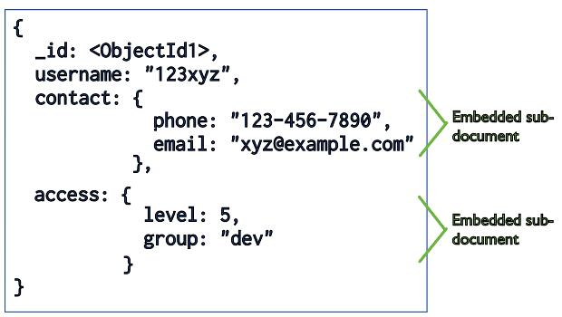
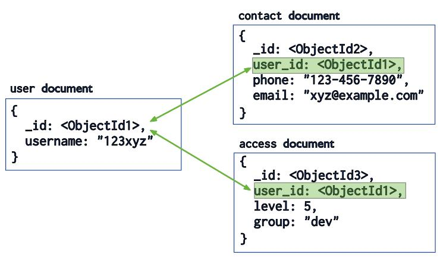

# Model Data di MongoDB

## Konsep Dasar

Data dalam MongoDB tersimpan dalam suatu *document* dan sekumpulan *document* tersebut membentuk
*collection*. Sekumpulan *collections* membentuk *database*. Ekuivalensi dengan SQL kurang lebih
sebagai berikut:

SQL:

```
fakta -> data -> record dan field -> tabel -> database
```

MongoDB:

```
fakta -> data -> document -> collection -> database
```


*Document* satu dengan lainnya dalam suatu *collection* mempunyai skema yang fleksibel meskipun jika
diperlukan bisa juga dilakukan validasi untuk skema.

## Struktur *Document*

Suatu data yang berelasi dalam MongoDB dapat direpresentasikan dalam bentuk *embedded sub-document*:



Sumber: [manual MongoDB](https://docs.mongodb.com/manual/core/data-modeling-introduction/).

MongoDB juga memungkinkan adanya *references*, sejenis *relationship* di RDBMS:



Sumber: [manual MongoDB](https://docs.mongodb.com/manual/core/data-modeling-introduction/).


