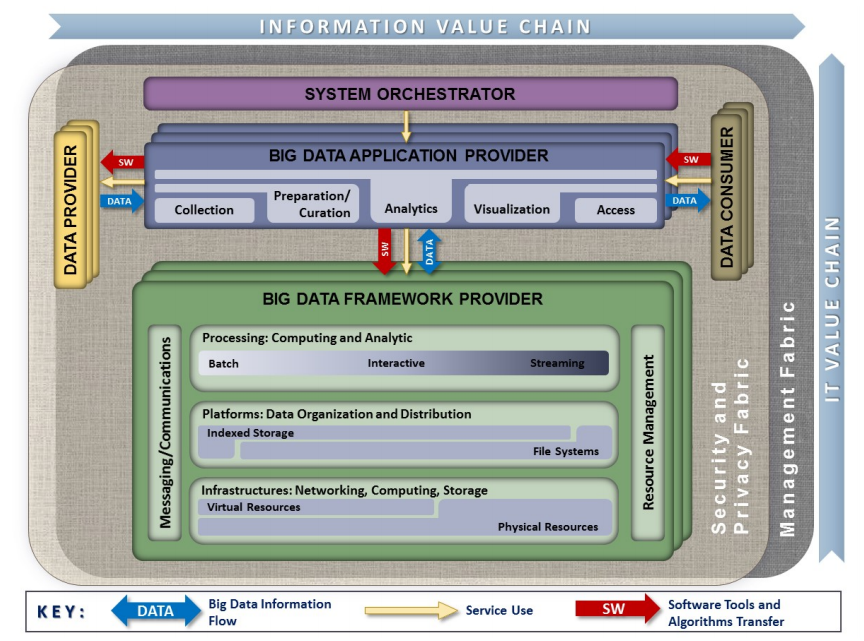
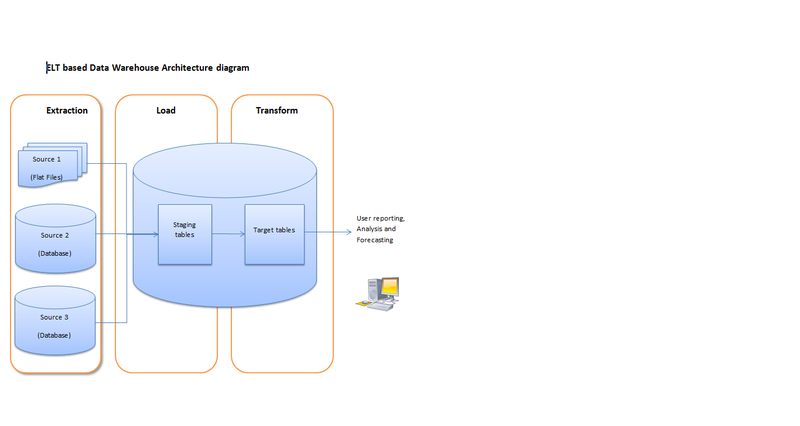
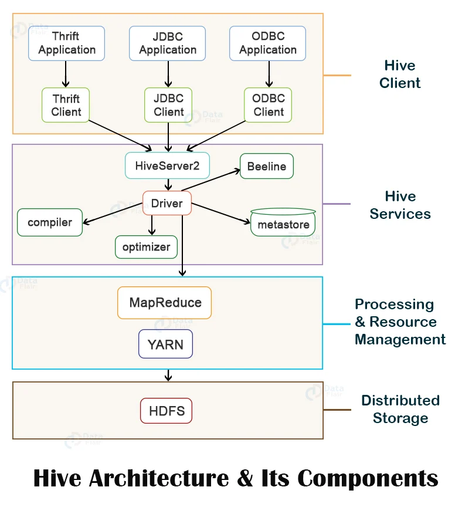
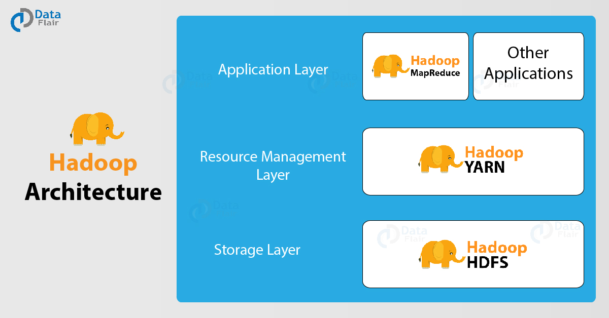

# Gambaran Umum

## Big Data

### Pengertian Big Data

Big Data merupakan kumpulan dari data sets yang sangat besar, masif, dan kompleks yang memungkinkan untuk dianalisis secara komputasional untuk menghasilkan berbagai pola, *insights*, trend maupun keterkaitan antara satu dengan lainnya terutama terkait dengan perilaku dan interaksi manusia. Data yang terdapat dalam Big Data biasanya sangat besar dan / atau bergerak dengan sangat cepat sehingga sulit untuk diproses oleh DBMS serta teknik dalam software tradisional.

### Contoh Big Data

1.  Restauran-restauran waralaba
2.  Transaksi perbankan
3.  Media dan hiburan
4.  Travel dan industri pariwisata
5.  Data terkait perawatan kesehatan

### Karakteristik Big Data

Ada beberapa karakteristik Big Data, semuanya dimulai dengan huruf V. Awalnya hanya ada 3 sehingga disebut sebagai 3V. Beberapa buku serta referensi mungkin mempunya jumlah V yang berbeda.

1.  Volume: Jumlah dari data yang diproses dan disimpan sangat besar dan volumenya masif.
2.  Variety: Data yang diproses mempunyai tipe serta sumber yang sangat bervariasi, tidak hanya teks saja tapi juga meliputi data multimedia maupun data lain (misalnya file spreadsheet, file PDF, dan lain-lain)
3.  Velocity: Kecepatan data diproses dan dihasilkan pada Big Data berbeda dengan data tradisional. Velocity pada Big Data sering kali tersedia secara *real time*.
4.  Veracity: Kualitas dan nilai data bisa bagus atau bervariasi.

### Arsitektur Big Data

Arsitektur berisi berbagai komponen serta keterkaitan antar komponen yang membentuk suatu sistem. NIST mengeluarkan [arsitektur referensi Big Data](https://nvlpubs.nist.gov/nistpubs/SpecialPublications/NIST.SP.1500-6r2.pdf) yang bisa digunakan sebagai acuan untuk memahami dan membangun sistem Big Data. 

### Teknologi Big Data

1.  Scalable storage systems
2.  Distributed computing platform
3.  Development tools and framework
4.  Packaged analytical tools

### Pemakaian Big Data

Big Data dipakai pada berbagai instansi, organisasi, maupun berbagai keperluan:

1.  Pemerintah
2.  Pengembangan dan Pembangunan Berbagai Bidang
3.  Manufaktur
4.  Kesehatan
5.  Pendidikan
6.  Media
7.  Asuransi
8.  IoT

### Bentuk Data di Big Data

1.  Terstruktur
2.  Semi terstruktur
3.  Tidak terstruktur

### *Use Cases* untuk Big Data

1.  Pengembangan produk: membuat model prediksi untuk produk baru => Netflix, Procter and Gamble
2.  Prediksi pemeliharaan: data terstruktur (identitas dan spesifikasi mesin) dan semi/tidak terstruktur (sensor, temperatur mesin, log, errors, dan lain-lain) digabungkan dan dianalisis untuk menghasilkan kemungkinan masalah potensial sebelum waktunya.
3.  *Customer experience*: data dari mana saja digunakan untuk menangani hubungan dengan customer
4.  *Fraud and Compliance*: identifikasi data untuk mengindikasikan fraud.
5.  *Machine Learning*: Big Data memungkinkan untuk melatih mesin dengan lebih baik.
6.  Efisiensi operasional: data akan menghasilkan insights terhadap situasi operasional.
7.  Memicu inovasi: Big Data digunakan untuk menghasilkan inovasi dengan mempelajari interdependensi antar manusia dan komponen-komponen lainnya dan menghasilkan suatu cara baru.

## Data Warehouse, ETL, dan ELT

Data warehouse (sering juga disebut dengan EDW / Enterprise Data Warehouse - setelah ini akan digunakan singkatan DW atau EDW) merupakan komponen utama dari BI (Business Intelligence) beruapa sistem basis data yang digunakan untuk pelaporan serta analisis data.

DW biasanya dibangun dengan menggunakan suatu arsitektur tertentu. Arsitektur tersebut terdiri atas berbagi komponen yang membentu suatu jalur pipa (*pipelines*). Secara umum, ada 2 *pipelines* pendekatan arsitektural untuk membangun DW yaitu ETL dan ELT.

### ETL (*Extract-Transform-Load*)

Sumber: https://commons.wikimedia.org/wiki/File:Data_warehouse_architecture.jpg

### ELT (*Extract-Load-Transform*)

Sumber: https://commons.wikimedia.org/wiki/File:ELT_Diagram.png

## Tentang Apache Hive

Apache Hive adalah software yang digunakan untuk DW. Apache Hive menyediakan berbagai fasilitas untuk menulis dan membaca *datasets* yang sangat besar. Apache Hive menyediakan server yang digunakan untuk mengelola *datasets* serta cli (*command line interface*) untuk berinteraksi dengan server tersebut. Apache Hive juga menyediakan API untuk mengelola data melalui bahasa pemrograman tertentu (default: Java). *Datasets* yang dikelola berada pada penyimpanan yang terdistribusi (Apache Hadoop) sehingga memungkinkan *datasets* yang dikelola merupakan *datasets* yang sangat besar.

Apache Hive merupakan software bebas dengan lisensi **Apache License Version 2.0**. Versi lengkap lisensi tersebut bisa diperoleh di https://www.apache.org/licenses/LICENSE-2.0.html.

Dokumentasi serta software untuk Apache Hive bisa diperoleh di https://hive.apache.org/.

### Arsitektur dan Komponen Apache Hive

Apache Hive merupakan solusi DW pada sistem terdistribusi berbasis Hadoop. Arsitektur dari Apache Hive adalah sebagai berikut:

Sumber: https://cwiki.apache.org/confluence/display/hive/design

Sumber: https://data-flair.training/blogs/apache-hive-architecture/

### Ekosistem Apache Hive

Apache Hive merupakan solusi DW untuk Apache Hadoop. Dengan demikian pemahaman tentang Apache Hadoop juga diperlukan untuk lebih memahami Apache Hive. Apache Haddop (sering disebut juga dengan hanya Hadoop) adalah software yang dikembangkan dibawah Apache Software Foundation. Hadoop merupakan suatu framework yang memungkinkan pemrosesan datasets yang sangat besar dengan menggunakan cluster komputer dalam sistem yang terdistribusi dengan menggunakan model pemrograman yang tidak terlalu rumit.

Apache Hadoop memungkinkan untuk memanfaatkan satu maupun banyak sekali server (mesin - bisa sampai ribuan) dan masing-masing saling terkoordinasi bekerja bersama untuk memproses data sets yang sangat besar. Hadoop memungkinkan untuk mendeteksi dan menangani kesalahan di level aplikasi.

Arsitektur dan komponen Apache Hadoop adalah sebagai berikut:

Sumber: https://data-flair.training/blogs/hadoop-architecture/

Apache Hadoop terdiri atas:

1.  Hadoop common: utilitas umum
2.  HDFS: filesystem terdistribusi
3.  Hadoop YARN: job scheduling dan pengelolaan resource untuk cluster
4.  Hadoop MapReduce: pemrosesan parallel untuk data sets yang sangat besar
5.  Hadoop Ozone: object store untuk Hadoop
6.  Hadoop Submarine: engine untuk machine learning

Selain, software-software lain di bawah Apache Software Foundation yang terkait dengan Apache Hadoop adalah:

1.  Ambari: aplikasi Web untuk provisioning, mengelola, serta me-monitor cluster Apache Hadoop.
2.  Avro: sistem untuk serialisasi data.
3.  Cassandra: DBMS yang scalable tanpa SPF (Single Point of Failure) dengan model data key-value.
4.  Chukwa: sistem untuk pengumpulan data pada sistem terdistribusi.
5.  HBase: Basis data berbasis Hadoop.
6.  Hive: software untuk data warehouse
7.  Mahout: pustaka untuk machine leraning dan data mining.
8.  Pig: framework untuk data flow dengan komputasi parallel.
9.  Spark: clustering di atas Hadoop untuk komputasi data (ETL, machine learning, stream processing, dan komputasi graph)
10. Tez: data-flow programming framework yang dibangun di atas Hadoop YARN
11. ZooKeeper: menyediakan layanan koordinasi untuk aplikasi terdistribusi.
