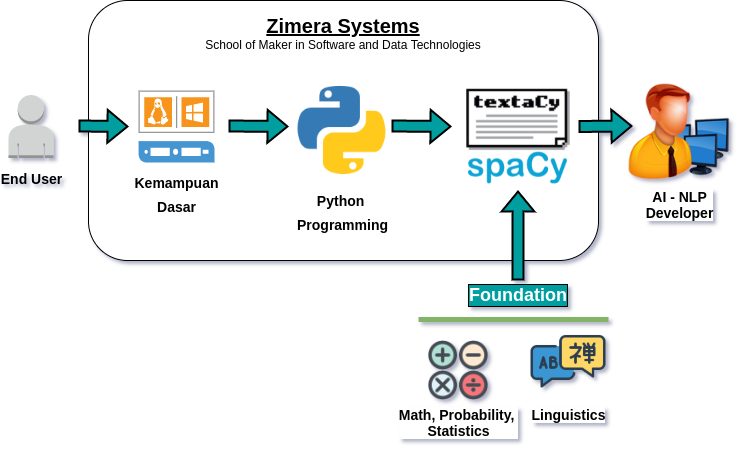

# Materi Pembelajaran "Natural Language Processing using Python and spaCy"

## Prasyarat:

1. [Kemampuan Dasar](../kemampuan-dasar.md)
2. [Python Programming](../python-programming/)
3. Ilmu Bahasa / Linguistik
4. Statistika dan Probabilitas

### Linguistik

Pengetahuan linguistik akan sangat menolong untuk memahami NLP. Meskipun demikian, pengethuan Linguistik ini bisa dipelajari bersama-sama dengan NLP jika belum memahami tentang linguistik sama sekali. Berikut adalah halaman Web yang bisa anda pelajari terkait dengan pengetahuan Linguistik untuk NLP:

1. Buku "Speech and Language Processing" oleh Daniel Jurafsky dan James H. Martin. Versi cetak adalah edisi 2. Untuk edisi 3, masih dalam proses penyiapan dan draft bisa diperoleh di https://web.stanford.edu/~jurafsky/slp3/. Untuk awal dan pemahaman garis besar secara umum serta pengetahuan Linguistik yang diperlukan, silahkan mempelajari bab 1 dari edisi 2 yang bisa diperoleh secara daring pada URL https://home.cs.colorado.edu/~martin/slp.html. Dengan menggunakan informasi yang ada pada bab 1 tersebut, bisa dipelajari berbagai hal yang terkait dengan Linguistik. Secara umum, berikut adalah beberapa halaman Wikipedia untuk beberapa materi inti Linguistik yang ada pada bab 1 tersebut:
    * [Phonology](https://en.wikipedia.org/wiki/Phonology): tidak digunakan pada materi ini, relatif lebih ke *speech recognition* untuk kalimat yang dibicarakan, bukan tulisan.
    * [Morphology](https://en.wikipedia.org/wiki/Morphology_(linguistics)): mempelajari tentang *words* / kata-kata, bagaimana kata tersebut dibentuk dan keterkaitannya dengan kata lain untuk membentuk makna.
    * [Syntax](https://en.wikipedia.org/wiki/Syntax): ketarkaitan struktural antar kata-kata.
    * [Semantics](https://en.wikipedia.org/wiki/Semantics): mempelajari arti / *meaning*.
    * [Pragmatics](https://en.wikipedia.org/wiki/Pragmatics): mempelajari konteks serta bagaimana kontribusi konteks tersebut terhadap makna.
    * [Discourse](https://en.wikipedia.org/wiki/Discourse): diskursus, mempelajari percakapan sebagai suatu bentuk komunikasi.
2. https://stats.stackexchange.com/questions/445316/how-much-linguistics-knowledge-does-one-need-to-study-natural-language-processin

### Statistika dan Probabilitas

Untuk overview tentang statistika dan probabilitas, disarankan untuk mempelajari seri *Schaum's* tentang probabilitas dan statistika. Versi cetak bisa diperoleh misal di https://www.amazon.com/Schaums-Outline-Statistics-Sixth-Outlines-dp-1260011461/dp/1260011461/ref=dp_ob_title_bk. Buku-buku lainnya tentu saja bisa digunakan, meski sejauh ini buku dari Schaun's series tersebut menyediakan penjalasan *to the point* beserta contoh yang relatif mudah untuk dipahami. Buku bebas yang bisa diperoleh di Internet:

* [Probability and Statistics - The Science of Uncertainty, Second Edition](http://www.utstat.toronto.edu/mikevans/jeffrosenthal/)
* [Probability and Mathematical Statistics](https://www.researchgate.net/publication/272237355_Probability_and_Mathematical_Statistics)

## Materi 

1.  Memahami Computational Linguistics, Ruang Lingkup NLP, serta Mulai Menggunakan spaCy.
2.  Operasi Inti NLP Menggunakan spaCy: *Text Processing Pipelines*.
3.  *Container Objects*.
4.  Fitur Linguistik dari spaCy: *POS-tagger, dependency parser, named-entity recognizer, merging/splitting*.
5.  *Word Vectors - Semantic Similarity*.
6.  *Matching Patterns - Phrases*.
7.  Visualisasi.
8.  Mengenali Intensi.
9.  Machine Learning dan NLP.
